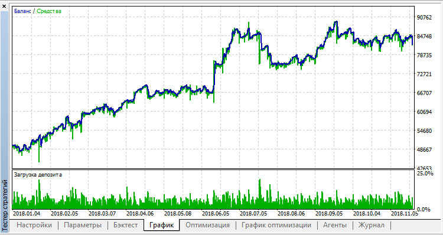
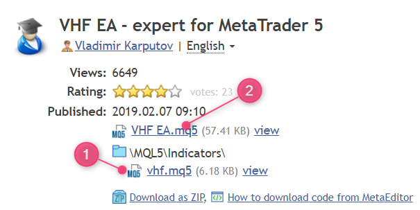
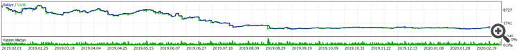
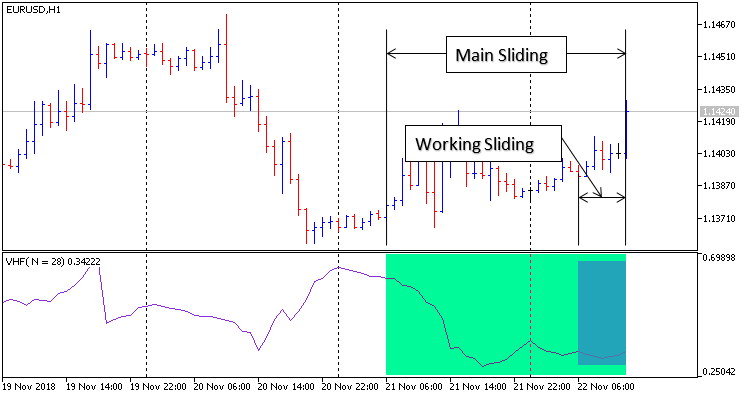

# VHF EA

## Description
This folder contains a professional trading expert advisor (EA) for MetaTrader 5.

Below are example screenshots of the strategy in action.  
*Feel free to explore, test, and improve!*

*You can add a detailed description of the strategy, parameters, and usage here.*

---

If you find this project useful, please consider giving it a star, sharing it, or even sending a small donation to support further development. Thank you!

## Files
- `vhf_ea.mq5`

## How to use
1. Copy the `.mq5` file to your MetaTrader 5 `Experts` folder.
2. Compile in MetaEditor.
3. Attach the expert to a chart.
4. Configure parameters as needed.
